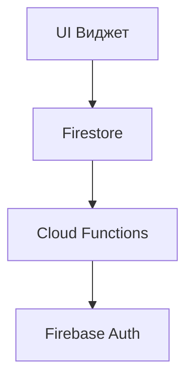

---
tags:
  - Лекция
Тема: 1.11 Система ввода-вывода
Количество часов: 2
Номер занятия: 24
Состояние: Нужно усовершенствовать 
---

# Анализ ОКР №2. Firebase. Виджеты главного экрана

## Цели и задачи лекции
- Понять структуру и назначение ОКР №2 в рамках проекта.  
- Ознакомиться с возможностями Firebase для хранения и синхронизации данных.  
- Научиться создавать и настраивать виджеты главного экрана.  
- Практически применить полученные знания в небольшом проекте.

## Ключевые понятия
| Термин | Определение |
|--------|-------------|
| ОКР (Определение Ключевых Ресурсов) | Схема описания ресурсов, необходимых для работы приложения. |
| Firebase | Платформа Google для разработки мобильных и веб‑приложений, включающая БД, аутентификацию и хостинг. |
| Firestore | Сервис Firebase для хранения данных в формате документов. |
| Виджет | Модуль пользовательского интерфейса, отображающий данные или функциональность. |
| Realtime Database | Сервис Firebase, предоставляющий синхронное хранение данных. |
| Authentication | Механизм проверки подлинности пользователей в Firebase. |
| Cloud Functions | Серверless‑функции, выполняемые в облаке Firebase. |
| SDK | Software Development Kit – набор библиотек для взаимодействия с Firebase. |

## Основное содержание

### 1. Введение в ОКР №2 (15 мин)
- Что такое ОКР №2 и как он соотносится с ОКР №1.  
- Структура ОКР №2: разделы, параметры, зависимости.  
- Пример заполнения ОКР №2 для учебного проекта.  

```yaml
# ОКР №2
project:
  name: "Управление задачами"
  version: "1.0"
resources:
  database: "Firestore"
  auth: "Firebase Auth"
widgets:
  - id: "tasks_list"
    type: "list"
    source: "tasks_collection"
```

### 2. Работа с Firebase (30 мин)
#### 2.1 Регистрация и настройка проекта (10 мин)
- Создание проекта в Firebase Console.  
- Добавление приложения (Android/iOS/WEB).  
- Скачивание `google-services.json` / `GoogleService-Info.plist`.

#### 2.2 Подключение SDK (10 мин)
- Установка пакетов через `pip` или `npm`.  
- Инициализация Firebase в коде.

```python
import firebase_admin
from firebase_admin import credentials, firestore

cred = credentials.Certificate('path/to/serviceAccountKey.json')
firebase_admin.initialize_app(cred)
db = firestore.client()
```

#### 2.3 Работа с Firestore (10 мин)
- Создание коллекций и документов.  
- Чтение и запись данных.  
- Слушатели изменений в реальном времени.

```python
tasks_ref = db.collection('tasks')
tasks_ref.add({
    'title': 'Изучить Firebase',
    'completed': False,
    'created_at': firestore.SERVER_TIMESTAMP
})
```

### 3. Аутентификация пользователей (15 мин)
- Регистрация и вход через email/password.  
- Использование анонимной аутентификации.  
- Ограничение доступа к данным через правила безопасности.

```python
auth = firebase_admin.auth
user = auth.create_user(email='user@example.com', password='secret')
```

### 4. Создание виджетов главного экрана (30 мин)
#### 4.1 Архитектура виджетов (10 мин)
- Определение интерфейса виджета.  
- Подключение к источнику данных.  
- Обновление UI при изменении данных.

#### 4.2 Пример виджета списка задач (20 мин)
```python
class TaskListWidget:
    def __init__(self, db_ref):
        self.db_ref = db_ref
        self.tasks = []

    def load_tasks(self):
        docs = self.db_ref.stream()
        self.tasks = [doc.to_dict() for doc in docs]
        self.render()

    def render(self):
        print("=== Текущие задачи ===")
        for task in self.tasks:
            status = "✓" if task['completed'] else "✗"
            print(f"{status} {task['title']}")
```

#### 4.3 Интерактивность (5 мин)
- Добавление новых задач через виджет.  
- Удаление и отметка как выполнено.

```python
def add_task(self, title):
    self.db_ref.add({'title': title, 'completed': False, 'created_at': firestore.SERVER_TIMESTAMP})
```

## Примеры и иллюстрации
- Диаграмма архитектуры приложения.  
- Скриншоты интерфейса виджета.  
- Псевдокод взаимодействия с Firestore.  



## Выводы по лекции
- ОКР №2 – ключевой документ, описывающий ресурсы и виджеты.  
- Firebase обеспечивает быстрый старт разработки с готовыми сервисами.  
- Виджеты главного экрана строятся вокруг данных из Firestore и обновляются в реальном времени.  
- Понимание структуры ОКР и работы с Firebase позволяет быстро разрабатывать масштабируемые приложения.

## Вопросы для самопроверки
1. Что такое ОКР и какие разделы включает ОКР №2?  
2. Какие преимущества дает использование Firestore вместо Realtime Database?  
3. Как реализуется аутентификация через Firebase Auth?  
4. В чем разница между `add()` и `set()` при работе с Firestore?  
5. Как виджет получает обновления данных из Firestore в реальном времени?  
6. Какие правила безопасности следует настроить для защищенного доступа к коллекции задач?  
7. Как подключить Firebase SDK к Python‑приложению?  
8. Что делает `firestore.SERVER_TIMESTAMP` при записи документа?  
9. Как можно реализовать удаление задачи из виджета?  
10. Какие преимущества дает использование Cloud Functions в архитектуре приложения?

## Рекомендуемая литература / источники
- "Python and Firebase: Practical Guide for Developers" – J. Smith, 2022.  
- "Мобильная разработка с Firebase" – А. Иванов, 2021.  
- "Документация Firebase" – официальные руководства, опубликованные Google.  
- "Основы архитектуры виджетов" – M. Brown, 2020.  
- "Безопасность данных в Firestore" – D. Green, 2023.

