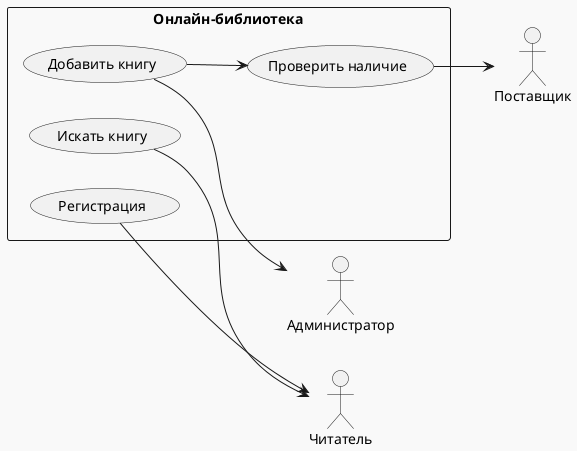

---
tags:
  - Лекция
Тема: 1.11 Система ввода-вывода
Количество часов: 2
Номер занятия: 32
Состояние: Нужно усовершенствовать 
---

# Создание диаграммы вариантов использования

## Цели и задачи лекции
1. Понять назначение и структуру диаграммы вариантов использования.  
2. Научиться выделять участников и сценарии взаимодействия.  
3. Освоить правила оформления диаграмм UML.  
4. Применить навыки в практическом проекте с использованием Python.

## Ключевые понятия
- **Диаграмма вариантов использования** – UML‑диаграмма, отображающая функциональные требования системы с точки зрения внешних пользователей.  
- **Участник (Actor)** – внешний объект, взаимодействующий с системой.  
- **Вариант использования (Use‑Case)** – набор шагов, выполняемых системой для достижения цели участника.  
- **Ассоциация** – связь между участником и вариантом использования.  
- **Включение (Include)** – обязательный подвариант, который всегда выполняется в рамках другого варианта.  
- **Расширение (Extend)** – необязательный подвариант, который выполняется при определённом условии.  
- **Обобщение (Generalization)** – наследование, где один участник или вариант использования наследует поведение другого.  
- **Система (System Boundary)** – граница, отделяющая внешние объекты от внутренней модели.  
- **Сценарий** – последовательность действий, описывающая конкретный поток выполнения.  
- **Текстовый сценарий** – детальное описание шагов, используемое при разработке кода.

## Основное содержание

### 1. Введение в UML и диаграммы вариантов использования (15 мин)
- История UML и его роль в системном анализе.  
- Преимущества диаграмм вариантов использования для коммуникации с заказчиком.  
- Сравнение с другими UML‑диаграммами (компонентная, последовательная).

### 2. Компоненты диаграммы (20 мин)
- **Участники**: как определять и классифицировать.  
- **Варианты использования**: формулировка целей и ограничений.  
- **Система**: как обозначить границу.  
- **Символы**: прямоугольники, овал, линия ассоциации, «include», «extend», «generalization».

### 3. Правила и стандарты оформления (15 мин)
- Согласованность названий (сингл‑сентенс, глагол + объект).  
- Упрощённые и расширенные варианты использования.  
- Конвенции по расположению элементов на диаграмме.  
- Применение меток «<<include>>», «<<extend>>».

### 4. Практическое моделирование: пример проекта «Онлайн‑библиотека» (30 мин)
1. **Сбор требований** – интервью с пользователями.  
2. **Выделение участников**: читатель, администратор, поставщик.  
3. **Определение вариантов использования**: поиск книги, регистрация, добавление книги.  
4. **Создание диаграммы** (область видимости, ассоциации, включения/расширения).  
5. **Проверка полноты** – сравнение с исходными требованиями.  

#### Краткая схема диаграммы (код в PlantUML для иллюстрации)


### 5. Интеграция диаграммы с кодом Python (15 мин)
- Как варианты использования переходят в функции/методы.  
- Пример реализации функции поиска книги в Python.  
- Применение паттерна «Command» для каждой операции.  

```python
class SearchBookCommand:
    def __init__(self, library, query):
        self.library = library
        self.query = query

    def execute(self):
        return self.library.find_book(self.query)
```

## Выводы по лекции
- Диаграмма вариантов использования – мощный инструмент для выявления требований и коммуникации с заказчиком.  
- Правильное определение участников и сценариев облегчает последующую разработку.  
- Оформление диаграммы согласно UML‑стандартам обеспечивает единообразие и понятность.  
- Интеграция диаграмм с кодом повышает согласованность между спецификацией и реализацией.

## Вопросы для самопроверки
1. Что такое «включение» в диаграмме вариантов использования?  
2. Какой символ обозначает участника в UML‑диаграмме?  
3. В чем разница между «extend» и «include»?  
4. Какой формат названий предпочтителен для вариантов использования?  
5. Как диаграмма вариантов использования помогает при разработке кода?  
6. Что обозначает «система» в контексте диаграммы?  
7. Какие типы участников можно выделить?  
8. Что происходит при использовании «generalization» между участниками?  
9. Как проверить полноту диаграммы по требованиям?  
10. Приведите пример кода, реализующего вариант использования «Регистрация».

## Рекомендуемая литература / источники
- Booch, G., Rumbaugh, J., Jacobson, I. *Unified Modeling Language User Guide*. 3rd ed., Addison‑Wesley, 2005.  
- Larman, C. *Applying UML and Patterns*. 3rd ed., Pearson, 2004.  
- Fowler, M. *Patterns of Enterprise Application Architecture*. Addison‑Wesley, 2002.  
- UML 2.5 Specification – Object Management Group, 2017.  
- Python Software Foundation. *Python 3.11 Documentation*, 2023.

